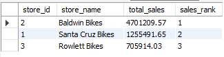

# 🚲 Bike Stores Sales Analysis

This project focuses on in-depth sales performance analysis and staff efficiency across different stores. The goal is to identify top-performing sales staff, uncover sales trends before and after June 2018, analyze customer behavior, and provide actionable insights to improve business performance

# Database Schema
The schema contains the following tables:
- **Brands**: Stores details about bike brands.
- **Categories**: Stores product category details.
- **Customers**: Stores customer information.
- **Order_items**: Stores details of the items ordered.
- **Orders**: Stores order details such as order dates and status.
- **Products**: Stores product details like brand, category, and pricing.
- **Staffs**: Stores information about staff members.
- **Stocks**: Stores stock levels of products across stores.
- **Stores**: Stores store information such as location and contact details.

## 🔨 Tools Used :
 &nbsp;

# Project Result :
[Click here to get full code](Analysis_CODE.sql)

# Query Task :
Q1 Which stores have the highest total sales?
 &nbsp;

Q2 Total sales per store and year?

Q3 monthly sales trend?

Q4 What are the top cities where most of the orders are placed?

Q5 Did Discounts Reduce After June 2018?

Q6 Total revenue per category?

Q7 Store-Wise Best Performing Staff?

Q8 Best sales seasons (Which quarter performs best?)

Q9 What are the most popular product categories by sales volume?

Q10 Effect of discounts on sales (Do discounts increase sales?)

Q11 Forecast next month’s sales ?(Simple moving average)

# Conclusion:

✔ Top-performing staff drive revenue → Recognizing and rewarding them can boost motivation and productivity.
✔ Sales decline post-June 2018 → Understanding why this happened (competition, economy, pricing changes) is crucial.
✔ Staff training needed for underperformers → Improving customer interaction and upselling strategies can increase revenue.
✔ Future forecasting & strategy → Investing in predictive analytics can help plan for upcoming trends.
